<div align="center">



# 🚀 VERTICAL-ARCH: DIKEY İNİŞLİ ROKET TEKNOLOJİLERİ
### [ Otonom İniş Sistemleri ve Havacılık Mühendisliği Ansiklopedisi - Revizyon v4.0 (ULTIMATE ARCHIVE) ]


</div>

---

## 📡 Taktik Operasyon Paneli (Mission Control HUD)
```text
[ MISSION PARAMETERS ]----------------------------------------------------------
STATUS: DEPLOYED          TARGET: 40.9922° N, 39.7711° E (Trabzon / KTÜ)
T+ TIME: 00:00:20         ALTITUDE: 154.2m         VELOCITY: -12.4m/s
THROTTLE: 62%             TVC ANGLE: 1.2°/ -0.8°    FS_MODE: AUTONOMOUS
ATM_P: 101.3 kPa          G-FORCE: 1.15g           DATA_RATE: 1.2 kbps
--------------------------------------------------------------------------------
[ SYSTEM HEALTH ]
GNSS [OK] | IMU [OK] | TVC [OK] | TELEM [OK] | POWER [12.6V] [92%] | TEMP [24°C]
--------------------------------------------------------------------------------
```

---

## 👨‍🚀 Mimari Vizyoner
**Bahattin Yunus Çetin** | *Sistem Mimarı & Otonom Kontrol Araştırmacısı*

> [!IMPORTANT]
> Trabzon Karadeniz Teknik Üniversitesi'nde (KTÜ) eğitimine devam eden otonom sistemler mimarı. Bu döküman, bir mühendisin bilgiye olan tutkusunun ve otonom geleceğe olan inancının bir yansımasıdır.

[](https://www.linkedin.com/in/bahattinyunus/)
[](https://github.com/bahattinyunus)

---

## 🏛️ Bölüm I: Yörüngesel Mekanik ve İniş Dinamiği

Dikey iniş teknolojisi, sadece düşük irtifa testleri için değil, yörünge sınıfı roketlerin (Orbital Class) geri kazanımı için tasarlanmıştır.

### 1. Delta-V Bütçesi ve Landing Burn
Bir roketin yörüngeden dönüp dikey inmesi için gereken hız değişimi ($\Delta V$):
$$\Delta V = V_e \ln \left( \frac{m_{initial}}{m_{final}} \right)$$
İniş aşamasında, atmosferik sürükleme kinetik enerjinin %90'ını yok ederken, kalan %10'luk kısım **Landing Burn** ile sıfırlanır.

### 2. Re-entry ve Isı Yönetimi
Atmosfere giriş hızı saniyede kilometrelerle ölçülür. Dikey inişli roketler, motorlarını "Retro-Propulsion" modunda kullanarak roketin önünde bir plazma kalkanı oluşturur ve yapısal ısınmayı azaltır.

---

## 🧠 Bölüm II: İleri Sensör Matematiği ve Füzyon

### 1. Kalman Filtresi: Kovaryans ve Gürültü
Sensör verileri hiçbir zaman mükemmel değildir. Filtre, **Süreç Gürültüsü ($Q$)** ve **Ölçüm Gürültüsü ($R$)** matrislerini kullanarak en iyi tahmini yapar.

*   **Öngörü Adımı:** $\hat{x}_{k|k-1} = \Phi \hat{x}_{k-1|k-1}$
*   **Güncelleme Adımı:** $K_k = P_{k|k-1} H^T (H P_{k|k-1} H^T + R)^{-1}$

> [!NOTE]
> $K_k$ (Kalman Kazancı), sensörüne mi yoksa modeline mi daha çok güveneceğine karar veren "beyindir".

---

## ⚡ Bölüm III: Aviyonik Güç Sistemleri ve EMI

### 1. PDN (Power Distribution Network) Tasarımı
Uçuş kontrol bilgisayarı (MCU) ve yüksek akım çeken servolar aynı hattan beslenemez.
*   **Isolation:** Opto-izolatörler kullanılarak gürültünün kontrol çekirdeğine sıçraması engellenir.
*   **Buck/Boost Converters:** Batarya voltajı (örn. 11.1V) düşse bile, işlemci için sabit 3.3V ve servolar için 6.0V üretilir.

### 2. EMI/EMC Kalkanlama
Motor sürücüleri (ESC) yüksek frekanslı elektromanyetik gürültü yayar. Aviyonik kutusu, **Faraday Kafesi** prensibiyle alüminyum folyo veya iletken boya ile zırhlanmalıdır.

---

## 💻 Bölüm IV: Havacılık Yazılım Standartları

Aerospace yazılımları, sıradan web uygulamalarından farklıdır. Kritik sistemlerde hata payı sıfırdır.

### 1. MISRA C Standartları
Kod yapısı, bellek sızıntılarını ve tanımsız davranışları engellemek için MISRA (Motor Industry Software Reliability Association) kurallarına uygun olmalıdır:
*   Dinamik bellek tahsisi (`malloc`) yasaktır.
*   Özyineleme (`recursion`) yasaktır.
*   Tüm döngülerin maksimum çalışma süresi (Timeout) olmalıdır.

### 2. HIL (Hardware-in-the-Loop) Testleri
Kod, gerçek donanım üzerinde ancak sanal bir ortamda test edilir:
- **PC:** Roketin fiziksel dünyasını simüle eder.
- **Flight Controller:** Gerçek donanımdır ve sensör verilerini PC'den "fake" olarak alır.

---

## 🛡️ Bölüm V: Güvenlik ve FMEA Arşivi

<details>
<summary><b>▶ Detaylı FMEA Analiz Tablosu (Genişletmek için tıklayın)</b></summary>

| Bileşen | Hata Senaryosu | Etki | Acil Durum Protokolü |
| :--- | :--- | :--- | :--- |
| **MCU** | Watchdog Reset | Kontrol kaybı | Dual-MCU Lockstep devreye girer. |
| **Barometre** | Basınç Sıçraması | Yanlış irtifa | IMU ivme verisiyle çapraz doğrulama. |
| **Servo** | Dişli Sıyırması | Yön kaybı | Kalan 1 eksenle stabilizasyon denemesi. |
| **Bağlantı** | Telemetri Kopması | Veri kaybı | Otonom iniş algoritması devam eder. |

</details>

---

## 📊 Bölüm VI: Tarihsel Kilometre Taşları

| Tarih | Araç | Geliştirici | Başarı |
| :--- | :--- | :--- | :--- |
| 1940s | V-2 | Peenemünde | İlk balistik roket teknolojisi temeli. |
| 1993 | DC-X | McDonnell Douglas | İlk başarılı dikey kalkış-iniş (VTVL) prototipi. |
| 2012 | Grasshopper | SpaceX | Modern otonom dikey inişin doğuşu. |
| 2015 | Falcon 9 | SpaceX | İlk kez yörünge görevinden dönen birinci aşama inişi. |
| 2025 | Vertical-Arch | B. Yunus Çetin | TEKNOFEST 2025 - Otonom İniş Mimarisi. |

---

## 🏗️ Bölüm VII: Sistem Mimarisi ve Yazılım Akışı

```mermaid
graph TD
    subgraph "SENSÖR KATMANI"
        IMU[BNO055 IMU - Oryantasyon]
        BARO[BMP280 - İrtifa]
    end

    subgraph "İŞLEME ÇEKİRDEĞİ (RTOS)"
        TASK1[Navigation - 400Hz]
        TASK2[Control - 100Hz]
        TASK3[Telemetry - 10Hz]
    end

    subgraph "KONTROL"
        PID[PID & LQR Algorithms]
        TVC[Thrust Vectoring]
    end

    IMU --> TASK1
    BARO --> TASK1
    TASK1 --> TASK2
    TASK2 --> PID
    PID --> TVC
    TASK2 --> TASK3
    
    style İŞLEME ÇEKİRDEĞİ (RTOS) fill:#0d1117,stroke:#00e5ff,stroke-width:2px,color:#fff
```

---

## 🚀 Başlarken (Quick Start)

### Simülasyonu Koşun
```bash
python sim/flight_sim.py
```
*Bu simülasyon, Bölüm I'de anlatılan dinamikleri ve Bölüm II'deki sensör füzyon mantığını temel alır.*

---

<div align="center">

**[TEKNOFEST 2025] - Vertical-Arch Projesi**
*Bilgi, evrenin en büyük itki kuvvetidir.*

© 2025 Geliştiren: Bahattin Yunus Çetin. Tüm hakları saklıdır.
**KTÜ Havacılık Arşivi - Teknik Dökümantasyon Serisi.**

</div>
