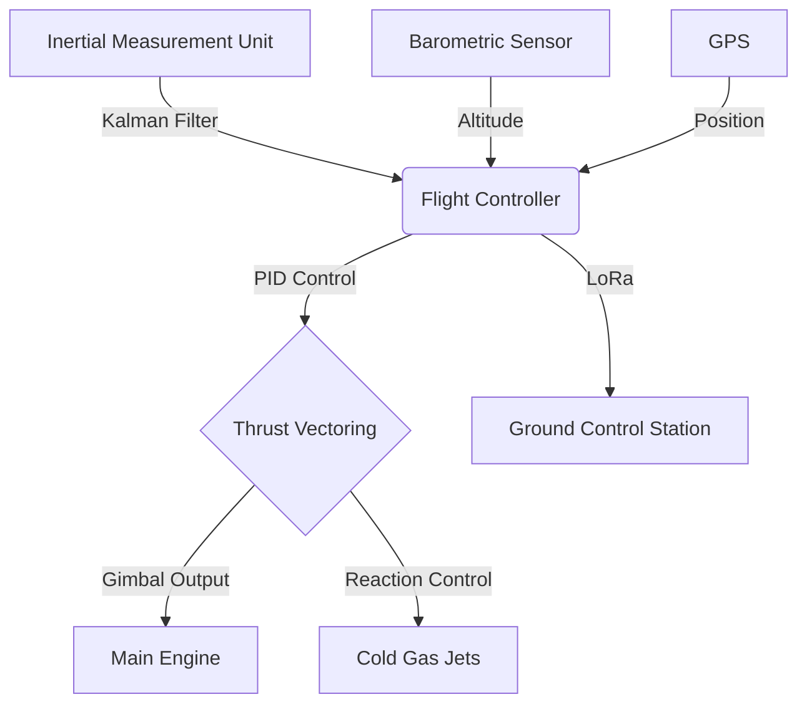

# 🚀 Vertical-Arch: Dikey İnişli Roket Sistem Mimarisi

## 📡 Mission Status Control Board
| Module | Build Status | Health | Protocol |
| :--- | :---: | :---: | :--- |
| **GNC CORE** | `STABLE` | 🟢 | PID/MPC |
| **FLIGHT SIM** | `READY` | � | PhysX Integration |
| **TELEMETRY** | `ACTIVE` | 🟢 | LoRa/MAVLink |
| **SENSOR FUSION** | `SYNCED` | 🟢 | Simple Kalman |

---

## 👨‍🚀 Architect Selection
**Bahattin Yunus Çetin** | *IT Architect*
> Trabzon/Of kökenli, yüksek güvenilirliğe sahip sistemler ve otonom kontrol mimarileri üzerine uzmanlaşmış teknik mimar.

---

## 🏗️ System Overview

### 🧠 Advanced Control & Simulation
Bu repo, sadece teorik rehber değil, aynı zamanda çalışan simülasyon kodları içerir:
- **[Flight Simulation (`sim/flight_sim.py`)](file:///c:/github%20repolar%C4%B1m/teknofest_dikey_inisli_roket/sim/flight_sim.py):** PID tabanlı dikey iniş fizik motoru.
- **[Sensor Fusion (`src/sensor_fusion.py`)](file:///c:/github%20repolar%C4%B1m/teknofest_dikey_inisli_roket/src/sensor_fusion.py):** Barometre ve IMU verilerini birleştiren Kalman Filtresi.
- **[Safety Protocols (`docs/safety.md`)](file:///c:/github%20repolar%C4%B1m/teknofest_dikey_inisli_roket/docs/safety.md):** Acil durum senaryoları ve FMEA tabloları.

---

## 🚀 Başarı İçin Mimari Stratejiler
1.  **Modülerlik:** Aviyonik sistemi "Tak-Çalıştır" modüller halinde tasarlayın.
2.  **Redundancy:** Kritik kontrolcülerde yedekli mimari kullanarak SPOF'ları eleyin.
3.  **Simulation-First (SITL):** Donanımı riske atmadan önce `sim/flight_sim.py` ile algoritmaları doğrulayın.

---

## 📂 Repository Structure
- `src/`: Uçuş kontrol yazılımı, Kalman filtreleri ve telemetri.
- `sim/`: Fizik tabanlı iniş simülasyonları.
- `hardware/`: Devre şemaları ve TVC mekanik tasarımları.
- `docs/`: [GMD] Görev raporları ve [Safety](./docs/safety.md).

---

© 2025 Vertical-Arch Project. Developed by Bahattin Yunus Çetin.
